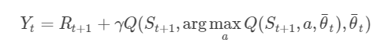
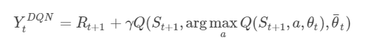

##  Double DQN

DQN无法克服 Q-Learning 本身固有的过估计问题，原因是其中的最大化操作。Double Q-Learning 将动作的选择和动作的评估分别用不同的值函数来实现，可以缓解此问题。

DQN 中采用两个结构相同的网络：Behavior Network 和 Target Network。虽然这个方法提升了模型的稳定性，但是 Q-Learning 对价值的过高估计的问题未能解决。Q-Learning 在计算时利用下一个时刻的最优价值，所以它通常会给出一个状态行动的估计上限。由于训练过程中模型并不够稳定，因此对上限的估计也会存在偏差。如果偏差不一致，那么这个偏差会造成模型对行动优劣的判断偏差，这样会影响模型效果。

在 Q-Learning 中，我们已经知道 Target Network 求解价值目标值得公式：

为了尽可能地减少过高估计的影响，一个简单的方法是把选择最优行动和估计最优行动两部分的工作分离。我们用Behavior Network 完成最优行动的选择工作。将该思想运动到 DQN 中，得到 Double DQN，其 TD 目标为:

