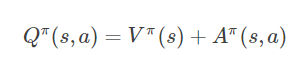
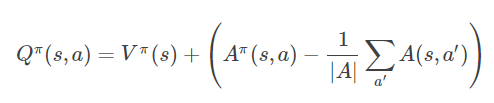

## Dueling DQN

Dueling DQN 从网络结构上改进了 DQN。它利用模型结构将值函数表示成更细致的形式，这使得模型能够拥有更高的表现.

值函数 QQ 被分解为状态值函数和优势函数（Advantage Function），即：

优势函数可以表现出当前行动和平均表现之间的区别：如果优于平均表现，那么优势函数为正，反之则为负。我们对优势函数加一个限定，我们知道优势函数的期望为 0，将公式变成：

让每个A值减去档期状态所有A值得平均值，可以保证期望值为0的约束，从而增加了整理输出的稳定性。

这样做到底有什么好处呢？首先，如果在某些场景下序号使用 V 的值，我们不用再训练一个网络。同时，通过显式地给出 V函数的输出值，每一次更新时，我们都会显式地更新 V函数。这样V函数的更新频率会得到确定性的增加，对于单一输出的Q网络来说，它的更新就显得有些晦涩。从网络训练角度看，这样做使得网络训练更友好且容易。

