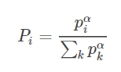

##  Prioritized Replay Buffer

优先回放的思想就是赋予学习效率高的状态以更大的采样权重。交互时表现越差，对应的权重就越高，这样可以更高效地利用样本。

一个选择是 TD 偏差 δ 。例如：我们设样本 ii 处的 TD 偏差为 δ， 则该处的采样概率为 

其中 pi=|δi|+ϵ 或者 pi=1/rank(i) 。|rank(i)| 根据 |δi|排序得到。

采用优先回放的概率分布采样时，动作值的估计是一个**有偏估计**.我们需要乘以一个重要性采样系数

我们使用PRB的收敛性并不确定，所以我们还是希望PRB最终变回RB，所以可以让 ββ 在训练开始时复制为一个小于1的数，然后随着训练迭代数的增加，让 ββ 不断变大，并最终达到 1。