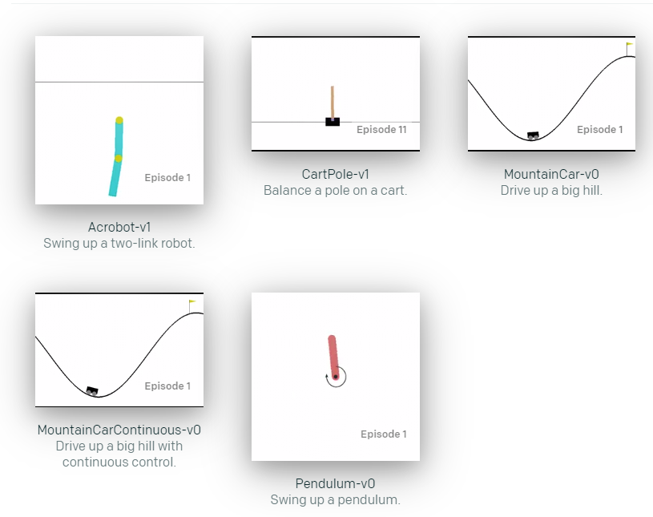

# Deep Q Network
[OpenAI-Baselines]("https://arztsamuel.github.io/en/blogs/2018/Gym-and-Baselines-on-Windows.html")

Introduction of [DQN]("DQN.md")

Introduction of [Prioritized Replay Buffer]("Prioritized Replay Buffer.md")

Introduction of [Dueling DQN]("Dueling DQN.md")

Introduction of [Double DQN]("Double DQN.md")

# Gazebo and Gym and Unity

### Gazebo-DQN

### Gym-DQN

### Unity